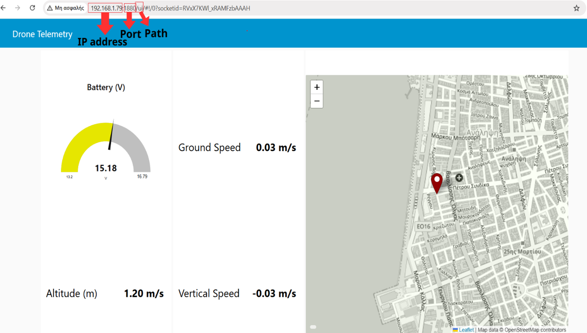

# Uav-obstacle-avoidance-system

# Description

This repository presents a semi-autonomous UAV designed to assist the pilot by automatically avoiding obstacles during flight while maintaining manual control under normal operating conditions. The pilot remains in full control of the UAV throughout the flight, while the onboard companion computer temporarily takes control only when an obstacle is detected within a predefined safety distance to safely perform an avoidance manoeuvre before returning control to the pilot.The system combines a flight controller, a companion computer, a LiDAR sensor for real-time obstacle detection, a camera for real-time image acquisition and artificial intelligence for human detection allowing the UAV to adapt its behaviour and perform safer avoidance manoeuvres. The project also includes a real-time telemetry dashboard and live video streaming. While the UAV is flying, the operator can monitor its status through the dashboard and watch the live camera feed with the AI human detection results in real time.

# Features

- Real-time obstacle detection .
- Semi-autonomous obstacle avoidance.
- Human detection .
- Dynamic speed reduction and increased safety distance when a person is detected.
- Live video streaming through a web browser.
- Real-time telemetry monitoring.
- Node-RED dashboard for flight visualization.
- MAVLink communication between Raspberry Pi and Pixhawk.
- MQTT communication for telemetry transmission

# Hardware Requirements

- Quadcopter Frame
- Pixhawk 2.4.8 Flight Controller
- Raspberry Pi 5
- Benewake TFmini Plus LiDAR
- Raspberry Pi Camera V2
- GPS Module 
- Motors
- ESCs
- Battery
- RC Transmitter
- RC Receiver

# Software Requirements (Raspberry Pi)

- Raspberry Pi OS Lite (64-bit)
- Python 3
- MAVLink / PyMAVLink (communication with the flight controller)
- OpenCV
- Ultralytics YOLOv8
- Flask (Live Video Streaming)
- PySerial (LiDAR Communication)
- Paho MQTT (Telemetry Transmission)
- Node-RED Dashboard
- Mosquitto MQTT Broker
- rpicam-vid (Raspberry Pi Camera Streaming)

## Communication Protocols

| Connection | Protocol |
|------------|----------|
| Raspberry Pi - Pixhawk | UART + MAVLink |
| Raspberry Pi - TFmini Plus LiDAR | UART (Serial) |
| Raspberry Pi Camera V2 - Raspberry Pi | CSI Interface |
| Camera Stream | TCP  |
| Telemetry Dashboard | MQTT |
| Live Video Streaming | HTTP (Flask MJPEG) |

## Installation

### Install Python Packages

```bash
pip install ultralytics
pip install opencv-python
pip install flask
pip install pymavlink
pip install pyserial
pip install paho-mqtt
```

### Install Additional Services

- Mosquitto MQTT Broker
- Node-RED
- rpicam-apps

## Telemetry Dashboard

The repository includes a pre-configured `dashboard_flows.json` file for the Node-RED dashboard.

### Setup

1. Start the MQTT broker:


```bash
sudo systemctl start mosquitto
```

2. Start Node-RED:

```bash
node-red
```

3. Open Node-RED:

```
http://localhost:1880
```

4. Import the provided `dashboard_flows.json` file:
<br>
<br>
The dashboard will be available at:

```
http://localhost:1880/ui
```

### Dashboard Features

The dashboard subscribes to the telemetry data published by the UAV through MQTT and provides real-time monitoring of:

- Battery voltage
- Relative altitude
- Ground speed
- Vertical speed
- GPS position

### MQTT Topics

- `drone/gps`
- `drone/alt`
- `drone/speed`
- `drone/vertical`
- `drone/battery`
<br>
<p align="center">
  
</p>

## Running the Project